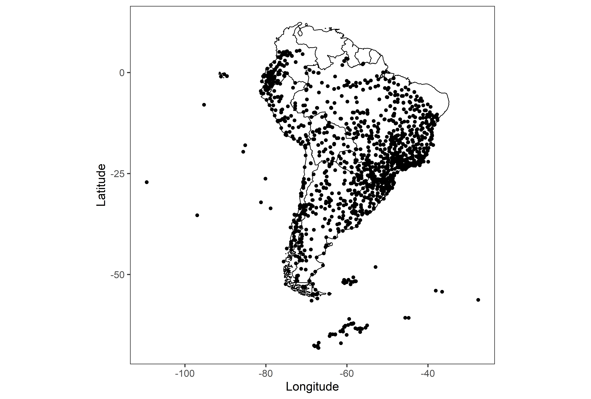
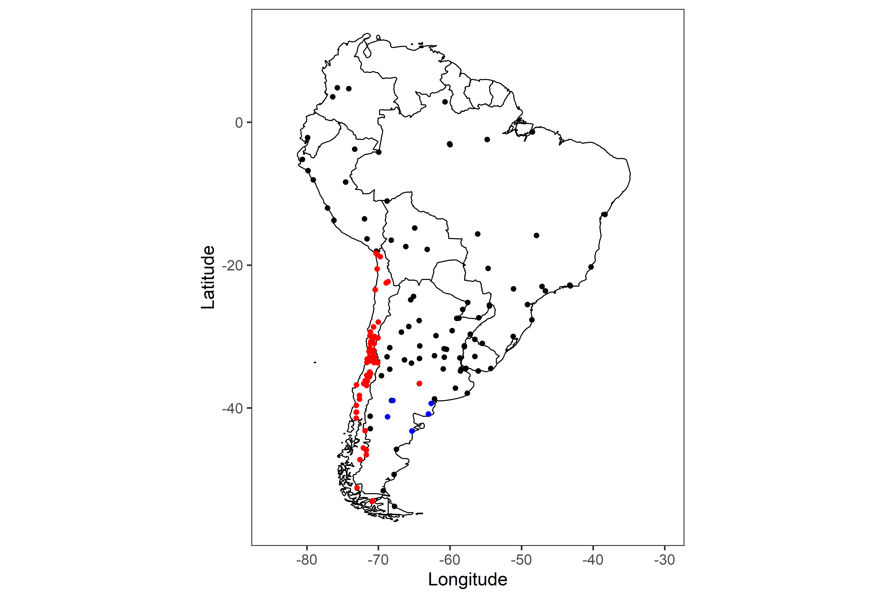
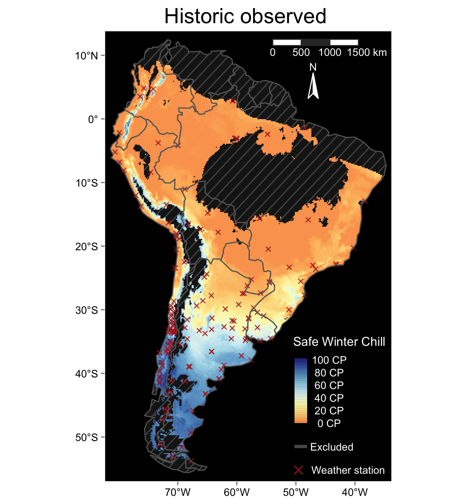

```{r, warning=FALSE, include = FALSE}
#Automatically write R package citation entries to a .bib file
knitr::write_bib(c(.packages(), 
                   'chillR',
                   'devtools',
                   'dormancyR'), 'packages.bib')
```

# Chill projections for South America

This repository contains the scripts generated to assess the impacts of climate change in South America. After projecting future temperatures, we computed safe winter chill accumulation at each location.

In earlier steps, we identified all available weather stations in South America. Information regarding these weather stations was obtained from the Global Surface Summary Of the Day database ([GSOD](https://data.noaa.gov/dataset/dataset/global-surface-summary-of-the-day-gsod)) by accessing functions contained in the `chillR` package [@R-chillR]. This procedure resulted in about 1,500 available weather stations.

<a></a>

To keep using those weather stations having a good amount of data, we filtered the weather stations with 90% of complete records between 1980 and 2017. Additionally, we added a number of weather stations from different databases (i.e. a Chilean - through the `dormancyR` package [@R-dormancyR] - and Argentinean database). This addition yielded about 155 weather stations.

<a></a>

We interpolated chill accumulation between stations and produce a surface winter chill map.

<a></a>

To cite this work please refer to the main muscript submitted to the journal Climatic Change:

"Fernandez, E., Caspersen, L., Illert, I., and Luedeling, E. (under review). Warm winters challenge the cultivation of temperate species in South America --- a spatial analysis of chill accumulation. Climatic Change."

The repository is structured as follows:

- `code/` contains all scripts generated to obtain the data and generate the projections, as well as prepare the figures
- `figures/` contains all figures generated during the process
- We do not included `data/` since all data can be generated with the scripts (except for weather data from Argentinean databases for which we recommend a email request due to external ownership). It is important to note that all scripts refer to `data/`, so we recommend to create the directory after downloading the repository. We also recommend adapting all directory paths to your local system

# References