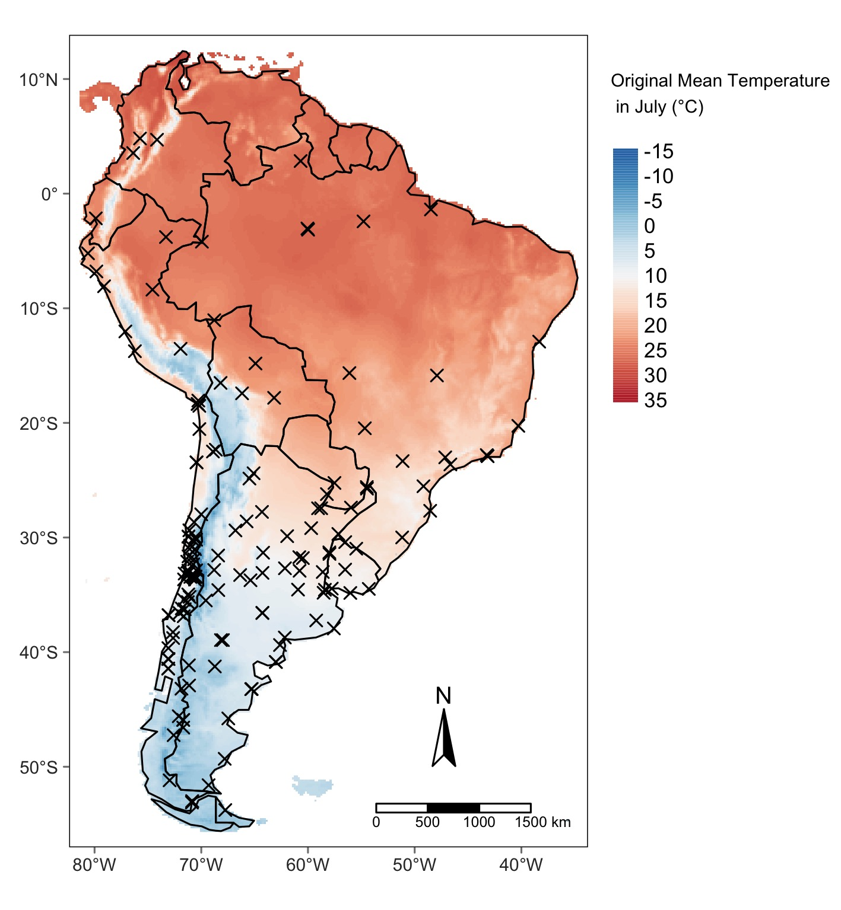
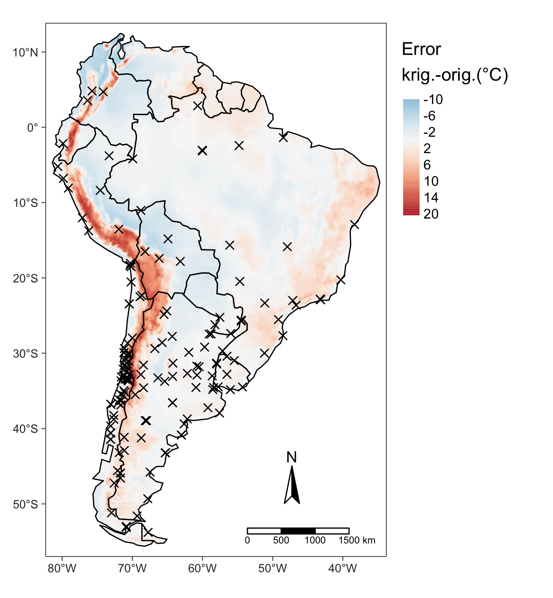

How to: Chill Interpolation
================
L. Caspersen
5/4/2021

## Introduction

This document should guide trough the interpolation of safe winter chill
for deciduous fruit trees. Chill interpolation was already successfully
carried out on a small scale (Benmoussa et al. 2020) and even world wide
projections were done (Luedeling et al. 2011). However, there no maps of
interpolated chill in a high resolution available for South America.
Climate data preparation and chill calculation was done by E. Fernandez
and the accompanying code can be found in his [git
repository](https://github.com/EduardoFernandezC/chill_south_america).

## Concept

The here used interpolation follows closely the approach described by
Benmoussa et al. (2020). It aims to correct the kriged winter safe
winter chill (SWC) with one or more closely related proxies, which
spatial distribution is already known. The spatial explicit proxie
values at the climate stations are extracted. The proxy is then
spatially interpolated given only the stations information. The
resulting interpolation map of the proxy is compared to the “real” map
of the proxy. Since proxy and chill are closely related to each other,
the error of interpolated proxy and “real” map should be similar to the
error in the interpolated SWC and the (hypothetical) “real” map of SWC.
In a second step the associated SWC to the error in the proxy map is
approximated with a model and finally the kriged SWC is corrected with
the model output.

## Kriging

In a first step the chill was interpolated using the ordinary krigin
approach. The semi-variogramm was fitted according to the standard
procedure. However, the resulting map of SWC was unsatisfactory. The SWC
is expected to be higher in mountaineous areas, like the Andes, but due
to low climate station density north to Chile and Argentina, this was
only poorly captured. It becomes evident that the SWC map needs a
correction.

## SWC Proxies / Correction Variables

One or several variables, whcih are closely related to SWC and which
spatial distribution is known, is needed to correct SWC. An extensive
screening of proxy candidates was carried out. Unlike in other studies,
where either elevation (Benmoussa et al. 2020) or mean annual
temperature (Luedeling et al. 2011) a combination of mean minimum and
maximum temperature in July is used. Maps of proxies was taken from the
[WorldClim data base](https://www.worldclim.org/data/worldclim21.html).

Map of original minimum temperature in July (left), kriged minimum
temperature in July with only information at climate station (centre)
and difference of the two (right).

## Corection model

A combination of minimum and maximum temperature was used as correction
variable. WorldClim data was compared to local climate records, stations
with an absolute difference greater than 2°C in mean temperature of July
were excluded.

In order to quantify associated chill for other minimum and maximum
temperatures, the areas in between were spatially interpolated using
kriging. The result is a correction surface for many extreme temperature
combinations. Around 70% of all temperature combinations observed in
South America are covered by the model. Outlying combinations ususally
stem from either tropical rainforest or peaks of the Andes.

## Corecting the interpolated SWC

Values of original and interpolated correction variable were inserted to
extract the associated chill. Then associated chill of the interpolated
correction variable is subtracted from the SWC of original proxy,
resulting in a map showing in which regions chill should by added or
subtracted from the map of interpolated SWC. Blue areas show regions in
which SWC should be added to kriged SWC and red areas show where chill
should be subtracted.

Finally the correction map is added to the kriged SWC map, by ensuring
that the correction does not lead to SWC values lower than 0. Areas in
which the correction model was not applicable are marked in grey dashes
on the final map.

This process was carried out for all years of interest (1981, 1985,
1989, 1993, 1997, 2001, 2005, 2009, 2013, 2017). Furthermore, the method
was applied on projections of future SWC for two periods of interest,
here marked by their centroid years 2050 and 2085. Furthermore, two
climate change scenarios were considered (RCP 4.5 and 8.5). In total 15
global climate models were utilized. Calculated SWC was then further
summarized using quantiles in optimistic (0.85), intermediate (0.5) and
pessimistic (0.15) model output. Furthermore, the change in SWC compared
to 2017 was calculated.

## Cross-Valdiation

Results were evaluated using the method of repeated k-fold
crossvalidation (5 repetions and k=7). This means that the data set of
climate stations is split randomly in k=7 groups of the same size. Each
of the seven groups is once treated as a validation data set while the
rest is combined to a training dataset to compile the final chill map.
Values of SWC in the final map constructed using only the training
dataset is compared to values at the location of the climate stations of
the evaluation dataset. Therefore each climate station was once part of
the evaluation dataset and k-1 times part of the training data set. The
difference of observed (value of evaluation dataset) and predicted
(value of interpolation map) is the residual. Since the grouping can
affect the outcome of the residuals, this process is repeated r=5 times
and the mean residual is computed. Size of the bubbles in the map
correspond to the absolute value of the residual, while the color
indicates if the interpolation either overestimated (negative residual,
red) or underestimated (positive resiudal, blue) the SWC value.

## References

Benmoussa, Haı̈fa, Eike Luedeling, Mohamed Ghrab, and Mehdi Ben Mimoun.
2020. “Severe Winter Chill Decline Impacts Tunisian Fruit and Nut
Orchards.” *Climatic Change* 162 (3): 1249–67.

Luedeling, Eike, Evan H Girvetz, Mikhail A Semenov, and Patrick H Brown.
2011. “Climate Change Affects Winter Chill for Temperate Fruit and Nut
Trees.” *PloS One* 6 (5): e20155.

